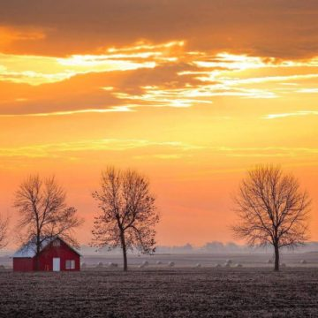
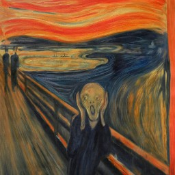
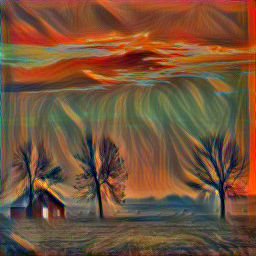
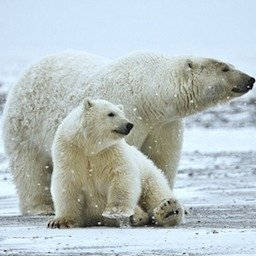
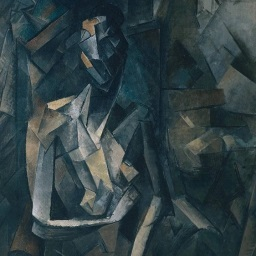
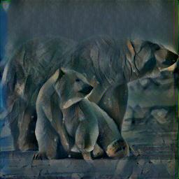

# Neural-Style-Transfer

Torch implementation of A Neural Algorithm of Artistic Style, by Gatis et al. : https://arxiv.org/pdf/1508.06576.pdf
The method uses pretrained VGG19, images are reshaped to fit in the network.
Content, style and generated specify respectively the content image, style image and the new image matching both style and content.

Some nice results : 

